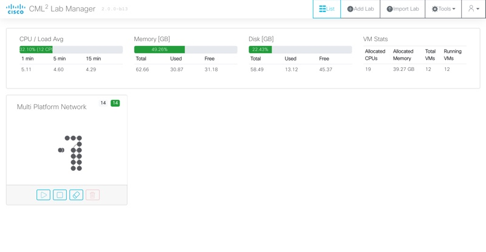
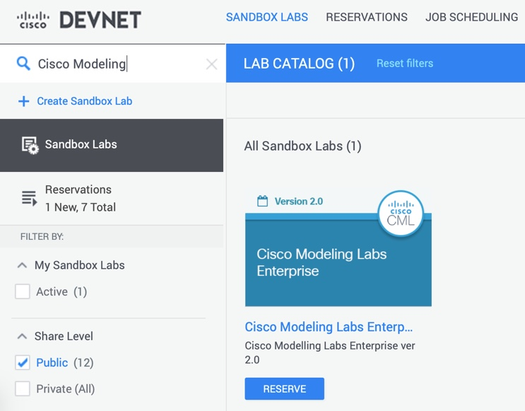

# CML Community

Community Contributed Content and Resources for Cisco Modeling Labs

 
## Repository Description

[Cisco Modeling Labs](http://developer.cisco.com/modeling-labs) (CML) is a network simulation platform from Cisco that allows for the creation of robust network topologies made up of nearly anything you can imagine. It supports virtual machine based devices using QCOW or KVM format, and can be tied into physical components by "bridging" the simulation to the real world.  

This repository is intended to be a place for the CML community to find and share content that builds on top of the standard CML installation.  Examples of this content include: 

### Node and Image Definition Files
Included with CML is a library of ["reference platforms"](https://developer.cisco.com/docs/modeling-labs/#!reference-platforms-and-images) for a variety of Cisco network devices as well as images for Linux servers, traffic generators, unmanaged devices, etc.  However, CML allows a "bring your own image" model for any KVM supported image.  While we **cannot** share the actual QCOW image files for nodes that require proper licensing and rights from individual platform owners, we can post the CML YAML file definitions that have been created to support different platforms from Cisco as well as third party vendors. 

The folder structure of this repository reflect the folder structure and naming conventions used on the CML server itself for storing the definitions. 

* [node-definitions](node-definitions) - Folder containing YAML file definitions for a CML node. The YAML file includes details on how the VM would be configured (ie CPU, RAM, Network Adapters, etc).
* [virl-base-images](virl-base-images) - Folder containing a folder for each added platform disk image. Within each platform folder you will find a YAML file that references a specific `disk_image` file for a platform. A base image definition will reference a node definition.
    * *Note: You will need to download the disk images from the vendors yourself.*

### Sample Lab Topologies 
CML includes a series of Sample Labs that are available from the Tools menu in Lab Manager, however these are just a start of the possible network simulations that can be created.  Within this repository users of CML can find, or share, network topologies that have been created to highlight a specific type of simulation challenge.

> Note: Sample Lab Topologies from this repository may leverage nodes that are **NOT** included with the standard reference platform for CML. Be sure to look at the requirements for any given lab topology. 

## DevNet Sandbox
A great way to make your repo easy for others to use is to provide a link to a [DevNet Sandbox](https://developer.cisco.com/site/sandbox/) that provides a network or other resources required to use this code. In addition to identifying an appropriate sandbox, be sure to provide instructions and any configuration necessary to run your code with the sandbox.

If you are new to Cisco Modeling Labs, you can explore and test drive CML within [DevNet Sandbox](https://developer.cisco.com/site/sandbox/). Just search for "Cisco Modeling" from the Sandbox Catalog. 

## Getting help

Instruct users how to get help with this code; this might include links to an issues list, wiki, mailing list, etc.

**Example**

If you have questions, concerns, bug reports, etc., please create an issue against this repository.

If you've questions on using CML, here are some places to checkout: 

* [Cisco Modeling Labs Support](https://developer.cisco.com/docs/modeling-labs/#!support)
* [Cisco Modeling Labs Webex Teams Space](https://eurl.io/#bWHTbWz1Z)

## Getting involved

We would **LOVE** to see this repository grow with community content. Please checkout [CONTRIBUTING](./CONTRIBUTING.md) for details on how to submit to this repository.

## Author(s)

This project was written and is maintained by the following individuals:

* Hank Preston <hank.preston@gmail.com>
* Joe Clarke <jclarke@marcuscom.com>
* Paul Van Lierop <pevanlierop@gmail.com>
* sig9 <sig9@sig9.org>
* Ozzy Schoonover <OzzySchoonover@gmail.com>
* Alexander Deca <alexander@deca-consulting.be>
* Xinyu Wei <trustywolf@sfc.wide.ad.jp>
* Kelly Christians <kelly.christians@rsmus.com>