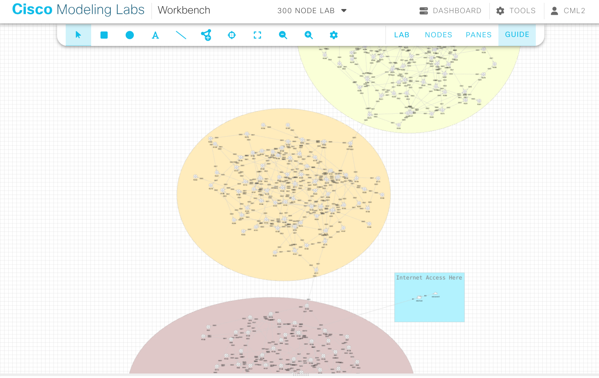

# README.md

## What is it

This lab topology has been created using a script available [here](https://github.com/rschmied/topogen).  
It's big and random. Yeah!

## Things to do
- the DNS host should have access to the Internet to install dnsmasq and iptables. It will provide Internet access for the entire lab and also acts as the DNS.
- name resolution for all routers is available, the server is the DNS host. All records point to the loopback addresses (e.g. things like `telnet r84` should work from everywhere).
- all routers run OSPF in area 0 `¯\_(ツ)_/¯`
- try some traceroute

> **Note**: Obviously, this needs a ton of resources (and licenses) to run. It's mostly a proof of concept and a bit of a scale test demo topology. Check the `topogen` repository (link above) to create smaller topologies.

