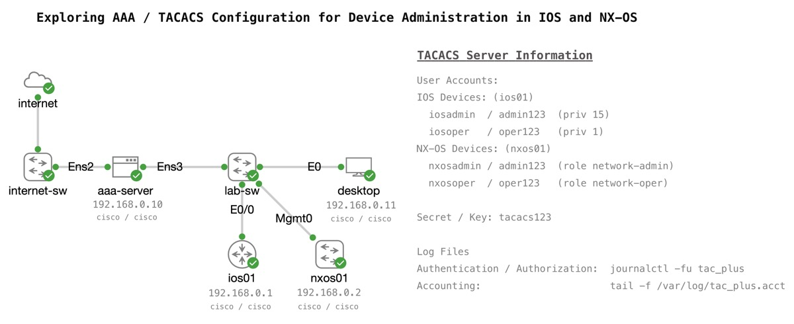

# Exploring AAA / TACACS Device Administration Configuration in IOS and NX-OS.


Verifying the identity of the people who log into network, what each person is allowed to do on a network device, and tracking what was done is a critical part of network operations.  Collectively these are known as "Triple A Services", or Authentication, Authorization, and Accounting.  Another name used is "Role Based Access Control", or RBAC.

TACACS+ is a common protocol used for RBAC / AAA on network devices, and this lab explores how to configure AAA on both IOS and NX-OS devices.  

> RADIUS is another protocol that can be used for device administration with AAA. 

A TACACS server must be available on the network for devices to send AAA requests to for validation. This lab leverages an open source `tac_plus` server as a lightweight service that can be easily installed on an Ubuntu host within the topology. For more information on `tac_plus` see the documentation for [`tac_plus`](https://manpages.ubuntu.com/manpages/trusty/man8/tac_plus.8.html) and [`tac_plus.conf`](https://manpages.ubuntu.com/manpages/trusty/man5/tac_plus.conf.5.html).  The starting config for `aaa-server` installs `tac_plus` and deploys a basic TACACS configuration to support IOS and NX-OS hosts connecting for user authentication, role based authorization (administrator and operator), and accounting. The configuration file `tac_plus.conf` is located at `/etc/tacacs/tac_plus.conf`. You can modify this configuraiton file and restart `tac_plus` (`sudo systemctl restart tac_plus`) as part of your own learning.

> Command authorization is not part of this lab guide, and the `tac_plus` server is ***NOT*** configured for command authorization as part of the initial configuration. Though you can update the `tac_plus.conf` file and experiment with command authorization on your own.

# Configuring an IOS device for TACACS device administration 

## Starting Configuration on `ios01`

`ios01` has the following configuration applied as startup configuration to enable inbound SSH from `desktop` that is locally authenticated. 

```
ip domain name lab.intra 
crypto key generate rsa general-keys modulus 2048
! 
aaa new-model
! 
username cisco priv 15 secret cisco
```


## Ensuring the serial / console leverages local authentication 
To provide safety and fallback access to devices, we will force the console line to only use local admin accounts. 

```
aaa authentication login CONSOLE local
aaa authorization console
aaa authorization exec CONSOLE local 
!
line con 0
 login authentication CONSOLE
 authorization exec CONSOLE
!
```

## Configuring TACACS server as default AAA 

Start by identitying the interface that TACACS packets should be sourced from. This is often important because TACACS servers typically only respond to known hosts/addresses. 

```
ip tacacs source-interface Ethernet0/0 
```

Now create the TACACS server entry for the server. Be sure to double check the "key" (secret) used for communications. 

> Note: Be careful to NOT add an extra "space" after the key. This can cause problems on some platforms. 

```
tacacs server aaa-server
 address ipv4 192.168.0.10
 key tacacs123
!
```

Create a `aaa group` that includes the TACACS server. In a production environment, you would typically have at least 2 TACASC servers configured for fallback.

```
aaa group server tacacs+ AAA-TACACS
 server name aaa-server
!
```

Test that the TACACS server is responding successfully. 

```
test aaa group tacacs+ iosadmin admin123 legacy
```

Configure the authentication, authorization, and accounting policies.

```
aaa authentication login default group AAA-TACACS local
aaa authorization exec default group AAA-TACACS local 
!
aaa accounting exec default start-stop group AAA-TACACS
aaa accounting commands 1 default start-stop group AAA-TACACS
aaa accounting commands 15 default start-stop group AAA-TACACS
!
```

## Testing the configuration 

Open the console for the `aaa-server` and monitor the service "journal"

```
journalctl -fu tac_plus
```

Open the console for the `desktop` and attempt to connect to `ios01` with SSH as the `iosadmin` user. 

```
ssh iosadmin@192.168.0.1
```

After you log in, run a command to verify access. 

```
show ip interface brief 
```

Check the output on the `aaa-server`. You should see messages for both the `authentication` and `authorization`

```
# Examples
Oct 07 21:30:36 aaa-server tac_plus[5704]: login query for 'iosadmin' port tty2 from 192.168.0.1 accepted
Oct 07 21:30:36 aaa-server tac_plus[5705]: connect from 192.168.0.1 [192.168.0.1]
Oct 07 21:30:36 aaa-server tac_plus[5705]: Start authorization request
Oct 07 21:30:36 aaa-server tac_plus[5705]: do_author: user='iosadmin'
Oct 07 21:30:36 aaa-server tac_plus[5705]: user 'iosadmin' found
Oct 07 21:30:36 aaa-server tac_plus[5705]: exec authorization request for iosadmin
Oct 07 21:30:36 aaa-server tac_plus[5705]: exec is explicitly permitted by line 4
Oct 07 21:30:36 aaa-server tac_plus[5705]: nas:service=shell (passed thru)
Oct 07 21:30:36 aaa-server tac_plus[5705]: nas:cmd* (passed thru)
Oct 07 21:30:36 aaa-server tac_plus[5705]: nas:absent, server:priv-lvl=15 -> add priv-lvl=15 (k)
Oct 07 21:30:36 aaa-server tac_plus[5705]: added 1 args
Oct 07 21:30:36 aaa-server tac_plus[5705]: out_args[0] = service=shell input copy discarded
Oct 07 21:30:36 aaa-server tac_plus[5705]: out_args[1] = cmd* input copy discarded
Oct 07 21:30:36 aaa-server tac_plus[5705]: out_args[2] = priv-lvl=15 compacted to out_args[0]
Oct 07 21:30:36 aaa-server tac_plus[5705]: 1 output args
Oct 07 21:30:36 aaa-server tac_plus[5705]: authorization query for 'iosadmin' tty2 from 192.168.0.1 accepted
```

Stop the journalctl monitor (`Cntrl-c`), and open the accounting log. 

```
tail -f /var/log/tac_plus.acct
```

> Note: If the command fails and the file isn't found, return to the SSH session to the router and run a couple commands.  The file isn't created until an accounting message is sent to the server. 

Run some more commands on `ios01`. Try some that are `priv 15` as well as `priv 1` 

```
! Priv 1
show ip route 
! Priv 15 
write mem
```

Verify the accounting logs were received. 

Logout from the router, and log in as `iosoper`. Verify through the same logs that the user is given the correct access.  

# Configuring an NX-OS device for TACACS device administration 

## Enabling and configuring TACACS for AAA on `nxos01` 
The Nexus network operating system requires features to be `enabled` before they can become available for configuration. Start by enabling `tacacs+`. 

```
feature tacacs+
```

Next configured `aaa-server` as a tacacs-server. 

```
tacacs-server host 192.168.0.10 key tacacs123
```

Create a server group for TACACS servers. Like with IOS, typically you would configured at least 2 `tacacs-server` entries for redundancy. 

> Nexus switches typically leverage a dedicated management interface (`mgmt0`) that is in a dedicated `management` VRF.  Be sure to configure the settings on the group, otherwise the switch will default to using the "global" or "default" VRF to reach the TACACS server, which may fail. 

```
aaa group server tacacs+ AAA-TACACS 
 server 192.168.0.10
 use-vrf management
 source-interface mgmt0
```

Test that the TACACS server is responding successfully. 

> Be sure to use the correct username for NX-OS devices.

```
test aaa group AAA-TACACS nxosadmin admin123
```

Now configure `aaa authentication login` to leverage the server.  

> NX-OS automatically falls back to try `local` authentication if the TACACS servers are unreachable. So it is ***not*** explicitly added like with IOS.

```
aaa authentication login default group AAA-TACACS
```

Unlike IOS, NX-OS automatically performs `exec` authorization as part of the `authentication login` process.  So no `aaa authorization` command is required.  

> If you explore the configuration commands, you will see `aaa authorization commands` as an option.  This would check for explicit per-command authorization from the TACACS server whenever a user attempts to run a command.  Command authorization is also supported on IOS devices.  
> 
> Command authorization is not part of this lab guide, and the `tac_plus` server is ***NOT*** configured for command authorization as part of the initial configuration. Though you can update the `tac_plus.conf` file and experiment with command authorization on your own.

Lastly, enable AAA accounting

```
! Track "enable" mode, and priv 15 and 1 commands 
aaa accounting default group AAA-TACACS
```

## Testing the configuration 

Open the console for the `aaa-server` and monitor the service "journal"

```
journalctl -fu tac_plus
```

Open the console for the `desktop` and attempt to connect to `nxos01` with SSH as the `nxosadmin` user. 

```
ssh nxosadmin@192.168.0.2
```

After you log in, verify role assigment.

```
show user-account nxosadmin

! Output
user:nxosadmin
        roles:network-admin vdc-admin 
account created through REMOTE authentication
Credentials such as ssh server key will be cached temporarily only for this user
 account
Local login not possible
```

Check the output on the `aaa-server`. You should see messages for both the `authentication` and `authorization`

```
# Examples
Oct 14 17:37:45 aaa-server tac_plus[5888]: connect from 192.168.0.2 [192.168.0.2]
Oct 14 17:37:45 aaa-server tac_plus[5888]: pap-login query for 'nxosadmin' port 0 from 192.168.0.2 accepted
Oct 14 17:37:46 aaa-server tac_plus[5889]: connect from 192.168.0.2 [192.168.0.2]
Oct 14 17:37:46 aaa-server tac_plus[5889]: Start authorization request
Oct 14 17:37:46 aaa-server tac_plus[5889]: do_author: user='nxosadmin'
Oct 14 17:37:46 aaa-server tac_plus[5889]: user 'nxosadmin' found
Oct 14 17:37:46 aaa-server tac_plus[5889]: exec authorization request for nxosadmin
Oct 14 17:37:46 aaa-server tac_plus[5889]: exec is explicitly permitted by line 20
Oct 14 17:37:46 aaa-server tac_plus[5889]: nas:service=shell (passed thru)
Oct 14 17:37:46 aaa-server tac_plus[5889]: nas:cmd= (passed thru)
Oct 14 17:37:46 aaa-server tac_plus[5889]: nas:cisco-av-pair* svr:absent/deny -> delete cisco-av-pair* (i)
Oct 14 17:37:46 aaa-server tac_plus[5889]: nas:shell:roles* svr:shell:roles="network-admin vdc-admin" -> replace with shell:roles="network-admin vdc-admin" (f)
Oct 14 17:37:46 aaa-server tac_plus[5889]: replaced 2 args
Oct 14 17:37:46 aaa-server tac_plus[5889]: authorization query for 'nxosadmin' 0 from 192.168.0.2 accepted
Oct 14 17:37:46 aaa-server tac_plus[5890]: connect from 192.168.0.2 [192.168.0.2]
```

Stop the journalctl monitor (`Cntrl-c`), and open the accounting log. 

```
tail -f /var/log/tac_plus.acct
```

You should see a `start` message for when you logged into the switch.

```
Oct 14 17:40:41 192.168.0.2     nxosadmin       0       192.168.0.11    start   task_id=192.168.0.11@pts/3      start_time=1728927636   timezone=UTC    service=none
```

Run the command `show version`. You will ***NOT*** see accounting messages on the server.  NX-OS only supports command accounting for "admin" commands.

Run the command `copy run start`. You should see a message such as: 

```
Oct 14 17:51:51 192.168.0.2     nxosadmin       0       192.168.0.11    stop    task_id=192.168.0.11@pts/3      start_time=1728928303   timezone=UTC    cmd=copy running-config startup-config (SUCCESS)    service=none
```

Try to configure a loopback interface.

```
config t 
interface loop1
```

You should see an accounting message. 

```
Oct 14 17:51:04 192.168.0.2     nxosadmin       0       192.168.0.11    stop    task_id=192.168.0.11@pts/3      start_time=1728928256   timezone=UTC    cmd=configure terminal ; interface loopback1 (SUCCESS)      service=none
```

Disconnect from the SSH session to `nxos01`.  You should see a `stop` message in the accounting log. 

```
Oct 14 17:40:44 192.168.0.2     nxosadmin       0       192.168.0.11    stop    task_id=192.168.0.11@pts/3      start_time=1728927638   timezone=UTC    stop_time=1728927638    service=none
```

Logout from the router, and log in as `tacoper`. Verify through the same logs that the user is given the correct access.  

# Other useful commands and references

### Network Device Debug commands

***IOS:***

```
debug aaa authentication
debug aaa authorization 
debug aaa accounting 

debug tacacs authentication
debug tacacs authorization
debug tacacs accounting 
```

***NX-OS:***


```
debug aaa aaa-requests
debug tacacs aaa-requests
```

### Network Device Show commands

**IOS:***


```
show tacacs
show aaa sessions 
```

***NX-OS:***


```
show tacacs-server 
show user-account
```

### Test AAA 

**IOS:***


```
test aaa group tacacs+ iosadmin admin123 legacy
```

**NX-OS:***


```
test aaa group AAA-TACACS nxosadmin admin123
```


### aaa-server logs 

***tac_plus logs:***


```
journalctl -fu tac_plus 
tail -f /var/log/tac_plus.acct 
tail -f /var/log/tac_plus.log
```

### tac_plus server maintenance 

***tac_plus srevice:***


```
systemctl status tac_plus 
sudo systemctl stop tac_plus 
sudo systemctl start tac_plus 
```