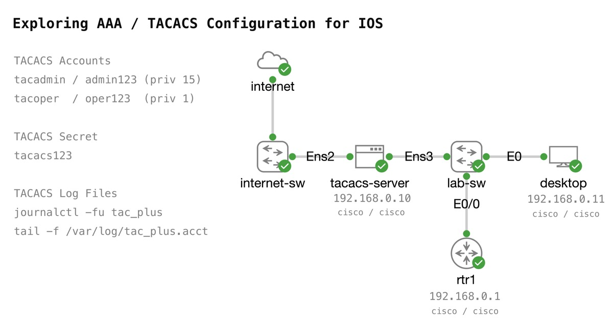

# Exploring AAA / TACACS Configuration for IOS 
Simple topology for practicing AAA TACACS configuration in IOS.



## Starting Configuration 

`rtr1` has the following configuration applied as startup configuration to enable inbound SSH from `desktop` that is locally authenticated. 

```
ip domain name lab.intra 
crypto key generate rsa general-keys modulus 2048
! 
aaa new-model
! 
username cisco priv 15 secret cisco
```


## Ensuring the serial / console leverages local authentication 
To provide safety and fallback access to devices, we will force the console line to only use local admin accounts. 

```
aaa authentication login CONSOLE local
aaa authorization console
aaa authorization exec CONSOLE local 
!
line con 0
 login authentication CONSOLE
 authorization exec CONSOLE
!
```

## Configuring TACACS server as default AAA 

Start by identitying the interface that TACACS packets should be sourced from. This is often important because TACACS servers typically only respond to known hosts/addresses. 

```
ip tacacs source-interface Ethernet0/0 
```

Now create the TACACS server entry for the server. Be sure to double check the "key" (secret) used for communications. 

> Note: Be careful to NOT add an extra "space" after the key. This can cause problems on some platforms. 

```
tacacs server aaa-server
 address ipv4 192.168.0.10
 key tacacs123
!
```

Create a `aaa group` that includes the TACACS server. In a production environment, you would typically have at least 2 TACASC servers configured for fallback.

```
aaa group server tacacs+ AAA-TACACS
 server name aaa-server
!
```

Test that the TACACS server is responding successfully. 

```
test aaa group tacacs+ tacadmin admin123 legacy
```

Configure the authentication, authorization, and accounting policies.

```
aaa authentication login default group AAA-TACACS local
aaa authorization exec default group AAA-TACACS local 
!
aaa accounting exec default start-stop group ISE-TACACS
aaa accounting commands 1 default start-stop group AAA-TACACS
aaa accounting commands 15 default start-stop group AAA-TACACS
!
```

## Testing the configuration 

Open the console for the `tacacs-server` and monitor the service "journal"

```
journalctl -fu tac_plus
```

Open the console for the `desktop` and attempt to connect to `rtr1` with SSH as the `tacadmin` user. 

```
ssh tacadmin@192.168.0.1
```

After you log in, run a command to verify access. 

```
show ip interface brief 
```

Check the output on the `tacacs-server`. You should see messages for both the `authentication` and `authorization`

```
# Examples
Oct 07 21:30:36 tacacs-server tac_plus[5704]: login query for 'tacadmin' port tty2 from 192.168.0.1 accepted
Oct 07 21:30:36 tacacs-server tac_plus[5705]: connect from 192.168.0.1 [192.168.0.1]
Oct 07 21:30:36 tacacs-server tac_plus[5705]: Start authorization request
Oct 07 21:30:36 tacacs-server tac_plus[5705]: do_author: user='tacadmin'
Oct 07 21:30:36 tacacs-server tac_plus[5705]: user 'tacadmin' found
Oct 07 21:30:36 tacacs-server tac_plus[5705]: exec authorization request for tacadmin
Oct 07 21:30:36 tacacs-server tac_plus[5705]: exec is explicitly permitted by line 4
Oct 07 21:30:36 tacacs-server tac_plus[5705]: nas:service=shell (passed thru)
Oct 07 21:30:36 tacacs-server tac_plus[5705]: nas:cmd* (passed thru)
Oct 07 21:30:36 tacacs-server tac_plus[5705]: nas:absent, server:priv-lvl=15 -> add priv-lvl=15 (k)
Oct 07 21:30:36 tacacs-server tac_plus[5705]: added 1 args
Oct 07 21:30:36 tacacs-server tac_plus[5705]: out_args[0] = service=shell input copy discarded
Oct 07 21:30:36 tacacs-server tac_plus[5705]: out_args[1] = cmd* input copy discarded
Oct 07 21:30:36 tacacs-server tac_plus[5705]: out_args[2] = priv-lvl=15 compacted to out_args[0]
Oct 07 21:30:36 tacacs-server tac_plus[5705]: 1 output args
Oct 07 21:30:36 tacacs-server tac_plus[5705]: authorization query for 'tacadmin' tty2 from 192.168.0.1 accepted
```

Stop the journalctl monitor (`Cntrl-c`), and open the accounting log. 

```
tail -f /var/log/tac_plus.acct
```

> Note: If the command fails and the file isn't found, return to the SSH session to the router and run a couple commands.  The file isn't created until an accounting message is sent to the server. 

Run some more commands on `rtr1`. Try some that are `priv 15` as well as `priv 1` 

```
! Priv 1
show ip route 
! Priv 15 
write mem
```

Verify the accounting logs were received. 

Logout from the router, and log in as `tacoper`. Verify through the same logs that the user is given the correct access.  

## Other useful commands

### Debugs on the router 

```
debug aaa authentication
debug aaa authorization 
debug aaa accounting 

debug tacacs authentication
debug tacacs authorization
debug tacacs accounting 
```

### Show commands on router 

```
show tacacs
show aaa sessions 
```

### Test AAA 

```
test aaa group tacacs+ tacadmin admin123 legacy
```

### tacacs-server logs 

```
journalctl -fu tac_plus 
tail -f /var/log/tac_plus.acct 
tail -f /var/log/tac_plus.log
```

### tac_plus server maintenance 

```
systemctl status tac_plus 
sudo systemctl stop tac_plus 
sudo systemctl start tac_plus 
```