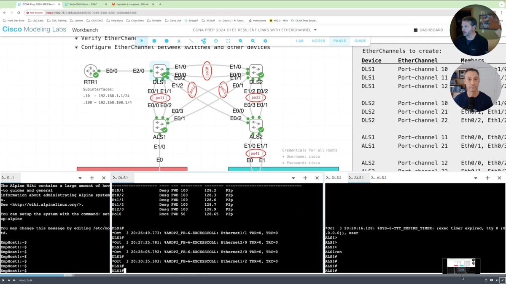

# CCNA Prep CML Resources
The CCNA Prep Program is a study resource put together by the Learning and Certifications team within Cisco to help engineers working towards earning their CCNA certification.  Each session dives into a topic from the CCNA blueprint, exploring it through a hands on/labs driven approach. These hands on labs are run on Cisco Modeling Labs and include full lab guides that can be used after the session for anyone to practice and hone their skills as they prepare for their CCNA Exam.  We are sharing the CML topology files with the CML Community for fun, learning and inspiration. 

> Sign up for CCNA Prep and access recordings from sessions at: [CCNA Prep Program](https://learningnetwork.cisco.com/s/ccna-live-stream)

## CCNA Prep Hosts 
The current hosts of the CCNA Prep Program are: 

**Hank Preston:** I'm a Principal Engineer at Cisco Systems, and my journey in network engineering began with the CCNA. Over the years, I've earned multiple certifications, including CCNP, CCIE, and DevNet Expert. My passion for networking and teaching has led me to help engineers worldwide through Cisco's learning and certification programs.

**Patrick Gargano:** As a Lead Content Advocate and Instructor at Cisco Learning & Certifications, I am responsible for developing and delivering official Cisco course content. I started my CCNA journey in 2000 when I became a  Cisco Networking Academy instructor. Since then, I've authored Cisco Press books and achieved multiple Cisco certifications. The CCNA was a pivotal point in my career, and I'm excited to share my experiences and insights with you.

## Season 1 (Fall 2024) - Back to Basics 

1. [Mastering VLAN Configuration: Unlock the power of VLANs](s1e1/README.md)
1. [Spanning Tree Protocol (STP) Unleashed: Navigate network efficiency](s1e2/README.md)
1. [Building Resilient Links with EtherChannel: Gain EtherChannel excellence](s1e3/README.md)
1. [Routing Fundamentals & Static Routes: Master concepts and static routes](s1e4/README.md)
1. [Conquering OSPF: Optimize your network with OSPF](s1e5/README.md)
1. [The Router's Guild: Adventures in AD, Metrics, and Prefix Lengths](s1e4/README.md)
1. [GET a Head(er) of REST APIs for the CCNA Certification](s1e7/README.md)

## Season 2 (Spring 2025) - IP Services

1. [DHCP in Action: Streamlining Network Client Address Management](s2e1/README.md)
1. [DNS Deepdive: Exploring a Backbone of Network Communication”](s2e2/README.md)
1. [Navigating NAT: Bridging Private Networks to the Internet](s2e3/README.md)
1. [Securing Network Access: From Telnet to SSH](s2e4/README.md)
1. [Syncing Success: The Role of NTP in Network Operations](s2e5/README.md)
1. The Syslog Detective: Unraveling Network Mysteries
1. Simplifying SNMP: Delivery Data for Network Operation Dashboards

<!-- Future episodes
1. [The Syslog Detective: Unraveling Network Mysteries](s2e6/README.md)
1. [Simplifying SNMP: Delivery Data for Network Operation Dashboards](s2e7/README.md) -->