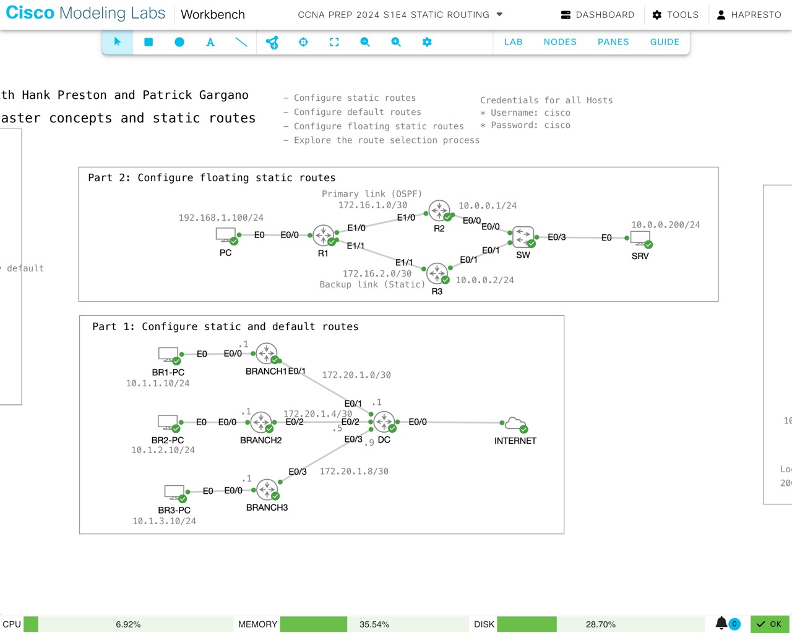

# Routing Fundamentals & Static Routes: Master Concepts and Static Routes
*Abstract:* Ready to advance your networking skills? Dive into our specialized live stream on Routing Fundamentals and Static Routes. Designed to lay a strong foundation in routing principles, this session provides the practical knowledge required to effectively configure static routes. Gain critical insights and hands-on tools to master routing concepts and ensure your network operates smoothly and efficiently. By the end of this session, you will have enhanced your network management capabilities.

> CCNA Prep returned to this topology for a second session: 
> **The Router's Guild: Adventures in AD, Metrics, and Prefix Lengths**
> 
> Starting where Episode 4 left off, this session will revisit the concepts of  administrative distance, metric, and prefix length, and how they are used to build the routing table and make packet forwarding decisions.

