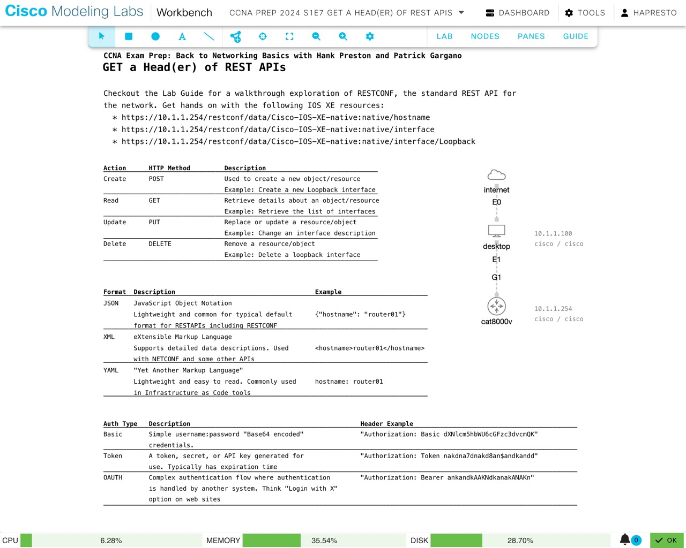

# GET a Head(er) of REST APIs for the CCNA Certification

*Abstract:* It is time to dive into network automation skills needed to succeed in the journey towards your CCNA certification. Learn everything you need to describe authentication, decode any possible CRUD operation, and handle JSON and XML results when working with REST APIs in this bonus CCNA Prep webinar.

