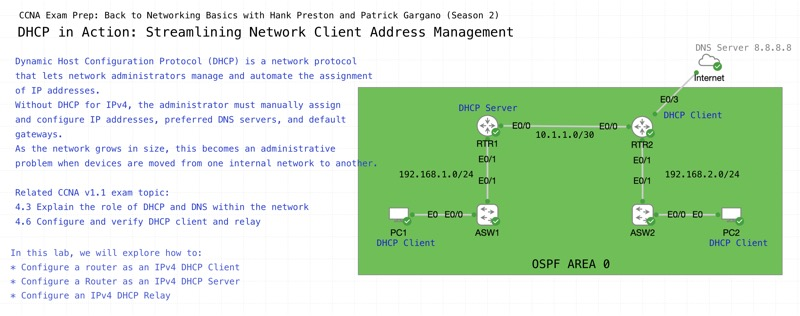

# DHCP in Action: Streamlining Network Client Address Management

*Abstract:* Review the essential role of Dynamic Host Configuration Protocol (DHCP) in managing network client address assignments in this practical, demonstration focused live event. Gain insights into configuring and verifying DHCP clients and relay agents, and reinforce how DHCP simplifies IP address distribution. Through real-world examples, you'll practice the skills needed to effectively manage and troubleshoot DHCP in your network environment as you prepare for your CCNA Exam.

