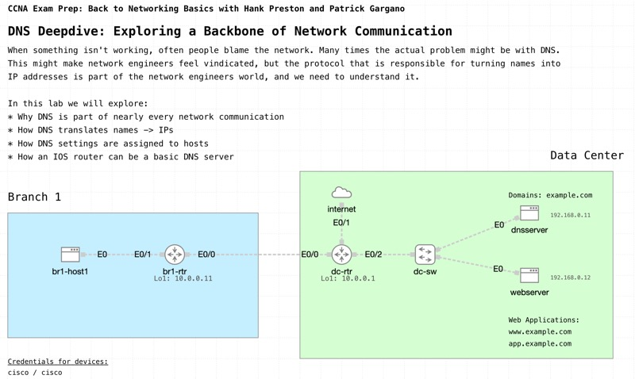

# DNS Deepdive: Exploring a Backbone of Network Communication

*Abstract:* Step into the dynamic world of DNS in this engaging, lab focused live event. Discover how to configure basic DNS servers and clients while unraveling the mystery of how domain names translate into IP addresses. Through practical demonstrations, you'll see firsthand how DNS keeps your network running smoothly and efficiently, mastering this vital technology before you take your CCNA exam.

