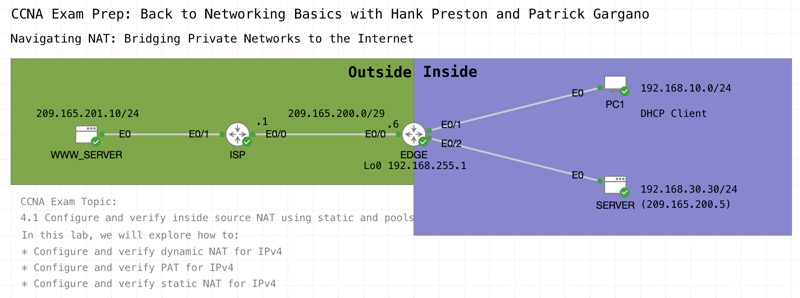

# Navigating NAT: Bridging Private Networks to the Internet

*Abstract:* Explore the critical role of Network Address Translation (NAT) in providing Internet access for networks using private IP addresses. In this live session, you'll review the configuration of NAT using static and pool techniques. The practical insights into how NAT enables efficient connectivity between private networks and the wider Internet will prepare you for your CCNA exam. 

