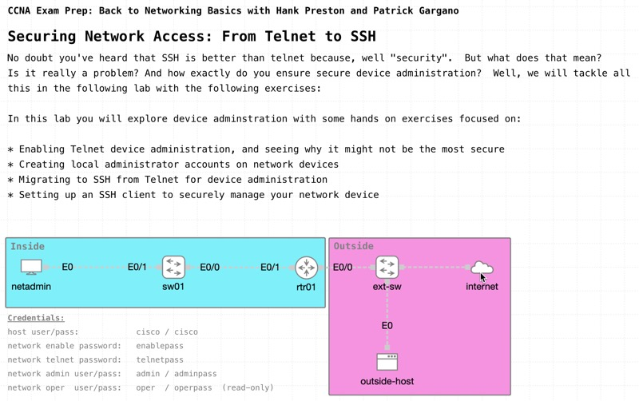

# Securing Network Access: From Telnet to SSH

*Abstract:* Discover why SSH is the preferred choice over Telnet for secure network management in this insightful event. Through hands-on activities, master the ins and outs to configuring SSH on Cisco switches and routers, ensuring encrypted and authenticated remote access. Understand the security implications of using SSH, and elevate your skills in managing network devices securely and efficiently. Join us as you prepare for your CCNA exam.

