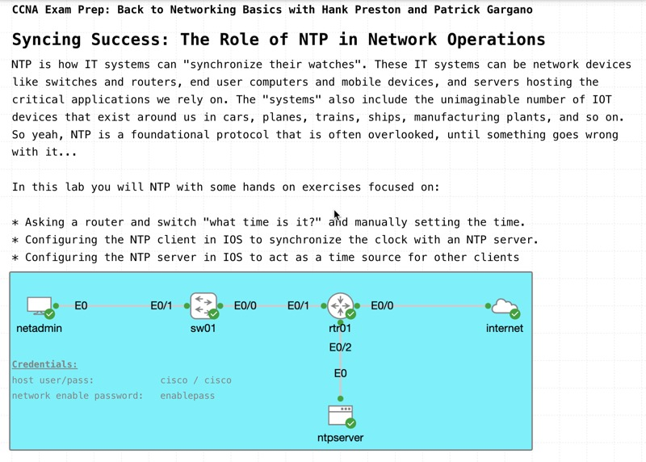

# Syncing Success: The Role of NTP in Network Operations

*Abstract:* Delve into the importance of Network Time Protocol (NTP) in maintaining synchronized time across network devices. In this session, review the steps to configure NTP for both client and server modes. Discover why synchronized time is crucial for accurate event logging, seamless coordination of network operations, and effective security measures. Master this important topic in “time” to take your exam.

