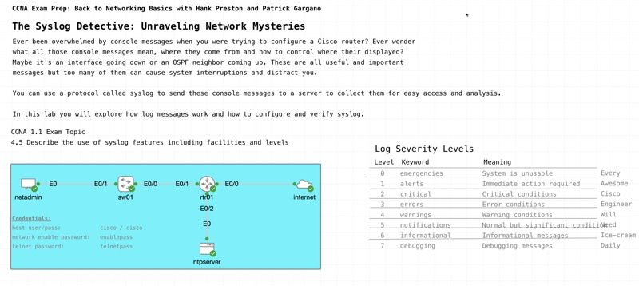

# The Syslog Detective: Unraveling Network Mysteries

*Abstract:* Step into the shoes of a network detective in this engaging live event, where Syslog serves as your investigative tool. Learn how to configure Syslog to capture and analyze crucial network events, uncovering the hidden clues within your infrastructure. Through hands-on exercises, we’ll master syslog’s role in solving network mysteries by piecing together performance insights, troubleshooting issues, and enhancing security monitoring. Join us to become a Syslog sleuth and complete your CCNA Preparation.

