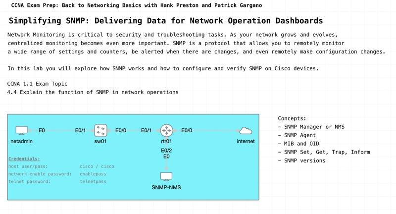

# Simplifying SNMP: Delivering Data for Network Operation Dashboards

*Abstract:* Discover the essential role of Simple Network Management Protocol (SNMP) in network operations during this interactive live event. Review why SNMP is a fundamental tool for monitoring and managing network performance, and how it provides critical insights into device status and operational health. Through practical exercises, you'll see SNMP's capabilities in action, enabling efficient network management and proactive troubleshooting. 

