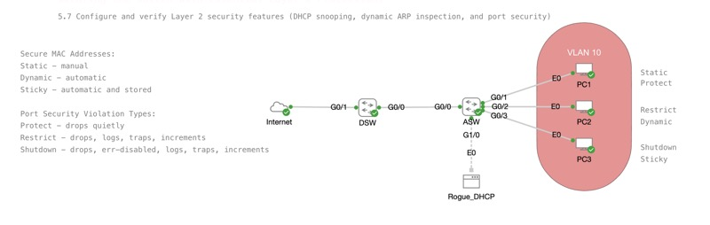

# Securing the Switch with Essential Layer 2 Protections

*Abstract:* Fundamental concepts and configuration of Layer 2 security features in enterprise networks are at the core of this discussion. Topics include common vulnerabilities at Layer 2, mitigation techniques such as port security, DHCP snooping, dynamic ARP inspection, and best practices for safeguarding switches. The session also addresses how these controls fit into a broader security strategy. Join us for this livestream event! 

