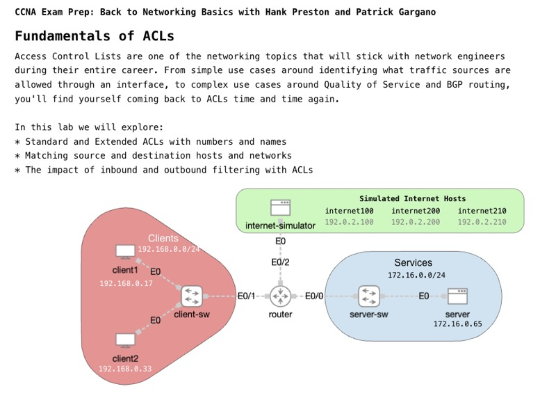

# Fundamentals of ACLs

*Abstract:* Access Control Lists, or ACLs, have been core to network security topics for CCNA candidates since the beginning.  If you want to control what traffic is allowed to pass through an interface, ACLs are a go-to technology.  But ACLs are used for far more than just simple interface filters. Access Control Lists, and the Access Control Entries (ACE) that make them up, provide network engineers with a powerful traffic matching language that can be used for everything from NAT to routing policies.

