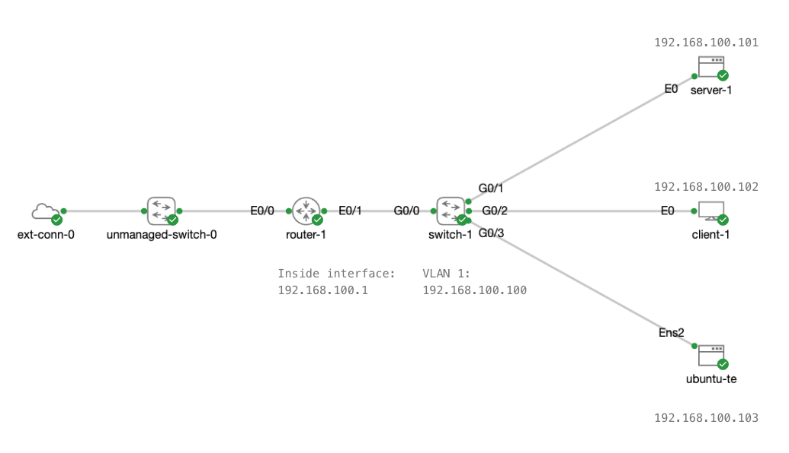

**Hybrid Networking Topology**

Cisco Modeling Labs - Free allows up to five nodes to run concurrently. 

The **External Connector** (`ext-conn-0`) and the **Unmanaged Switch** (`unmanaged-switch-0`) do not count against the device node limit of five. Besides these two nodes, for your Cisco Modeling Labs network, you have the following five nodes running:

1. `router-1`: an IOL router running Cisco IOS-XE version 17.15.1
2. `switch-1`: an IOL-L2 switch running Cisco IOS-XE version 17.15.1
3. `ubuntu-te`: Ubuntu Linux version 24.04.1 LTS (Noble Numbat)
4. `client-1`: Alpine Linux version 3.20.3
5. `server-1`: TinyCore Linux version 15.0




> **Note:** The provided Cisco Modeling Labs template ([hybrid-network-cml-topology.yaml](hybrid-networking-cml-topology.yaml)) for this tutorial is designed to minimize your setup time. The lab is preconfigured for connectivity between the nodes and the router, which will obtain an IP address via DHCP from your network and serve as the lab's default gateway. Everywhere in the Cisco Modeling Labs network topology where a password is required, the default of "cisco/cisco" has been used.

> **Note:** `server-1` is running TinyCore Linux, where Python 3 can be installed using the `tce-load` command.

```bash
tce-load -wi python3.9 
```