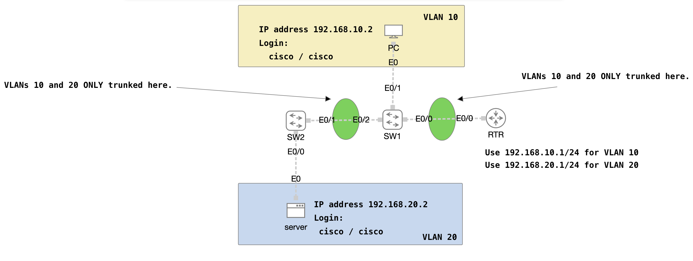

# VLAN Tasks

## Introduction

These topologies are designed to work with CML Free and give the learner VLAN-centric configuration
and verification tasks to perform.  The tasks themselves align with the CCNA exam blueprint's tasks
2.1 and 2.2.

## Getting Started

The `topology.yaml` file is the initial starting point.  Import it into CML using the **Import** button
from the CML Dashboard.

Within the lab, click the **GUIDE** button to view the instructions.

## Using the Solution

If you get stuck or just want to check your work, import the `topology-solution.yaml` file in the same
way you imported `topology.yaml`.  This provides you with the nodes configured correctly and a sample
`traceroute` output verifying the correct path is taken.

