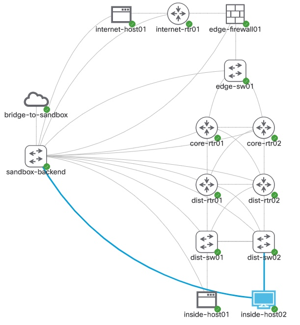

# Multi Platform Network 
This is an example topology that was built to provide a common topology for a variety of DevNet Sandbox labs and network automation use cases. It includes Cisco IOS XE, IOS XR, NX-OS, and ASA devices, as well as several Linux based servers and desktops. The simulation starts with a functional network configuration. 

## Requirements for Use 

* **Node and Image Definitions:** This topology leverages images available with the standard CML server software. No additional images are requried. 
* **CML Server Setup:** This topology leverages a bridged external connector and statically sets IP addresses on Management interfaces for all devices in the subnet `10.10.20.0/24`. 
    * If your local network does NOT use this same subnet (which is highly likely), you can update the topology file to change out IP addresses within node configurations before adding to your CML server

## Other Details
For reference, here is the list of devices and their static IPs and management access information.

  <table class="myTable">
    <tbody>
      <tr>
        <th>Component</th>
        <th>Type</th>
        <th>IP Address</th>
        <th>Method</th>
        <th>Credentials</th>
        <!-- <th>Username</th>
        <th>Password</th> -->
      </tr>
      <tr>
        <td>internet-host01</td>
        <td>Linux</td>
        <td>10.10.20.182</td>
        <td>SSH</td>
        <td><pre>cisco / cisco</pre></td>
        <!-- <td>cisco</td>
        <td>cisco</td> -->
      </tr>
      <tr>
        <td>internet-rtr01</td>
        <td>IOS XE</td>
        <td>10.10.20.181</td>
        <td>TELNET</td>
        <td><pre>cisco / cisco</pre></td>
        <!-- <td>cisco</td>
        <td>cisco</td> -->
      </tr>
      <tr>
        <td>edge-firewall01</td>
        <td>ASA</td>
        <td>10.10.20.171</td>
        <td>TELNET</td>
        <td><pre>cisco / cisco</pre></td>
        <!-- <td>cisco</td>
        <td>cisco</td> -->
      </tr>
      <tr>
        <td>edge-sw01</td>
        <td>IOS</td>
        <td>10.10.20.172</td>
        <td>TELNET</td>
        <td><pre>cisco / cisco</pre></td>
        <!-- <td>cisco</td>
        <td>cisco</td> -->
      </tr>
      <tr>
        <td>core-rtr01</td>
        <td>IOS XR</td>
        <td>10.10.20.173</td>
        <td>TELNET</td>
        <td><pre>cisco / cisco</pre></td>
        <!-- <td>cisco</td>
        <td>cisco</td> -->
      </tr>
      <tr>
        <td>core-rtr02</td>
        <td>IOS XR</td>
        <td>10.10.20.174</td>
        <td>TELNET</td>
        <td><pre>cisco / cisco</pre></td>
        <!-- <td>cisco</td>
        <td>cisco</td> -->
      </tr>
      <tr>
        <td>dist-rtr01</td>
        <td>IOS XE</td>
        <td>10.10.20.175</td>
        <td>TELNET</td>
        <td><pre>cisco / cisco</pre></td>
        <!-- <td>cisco</td>
        <td>cisco</td> -->
      </tr>
      <tr>
        <td>dist-rtr02</td>
        <td>IOS XE</td>
        <td>10.10.20.176</td>
        <td>TELNET</td>
        <td><pre>cisco / cisco</pre></td>
        <!-- <td>cisco</td>
        <td>cisco</td> -->
      </tr>
      <tr>
        <td>dist-sw01</td>
        <td>NX-OS</td>
        <td>10.10.20.177</td>
        <td>TELNET</td>
        <td><pre>cisco / cisco</pre></td>
        <!-- <td>cisco</td>
        <td>cisco</td> -->
      </tr>
      <tr>
        <td>dist-sw02</td>
        <td>NX-OS</td>
        <td>10.10.20.178</td>
        <td>TELNET</td>
        <td><pre>cisco / cisco</pre></td>
        <!-- <td>cisco</td>
        <td>cisco</td> -->
      </tr>
      <tr>
        <td>inside-host01</td>
        <td>Linux</td>
        <td>10.10.20.179</td>
        <td>SSH</td>
        <td><pre>cisco / cisco</pre></td>
        <!-- <td>cisco</td>
        <td>cisco</td> -->
      </tr>
      <tr>
        <td>inside-host02</td>
        <td>Linux</td>
        <td>10.10.20.180</td>
        <td>VNC</td>
        <td><pre>cisco / cisco</pre></td>
        <!-- <td>cisco</td>
        <td>cisco</td> -->
      </tr>
    </tbody>
  </table>