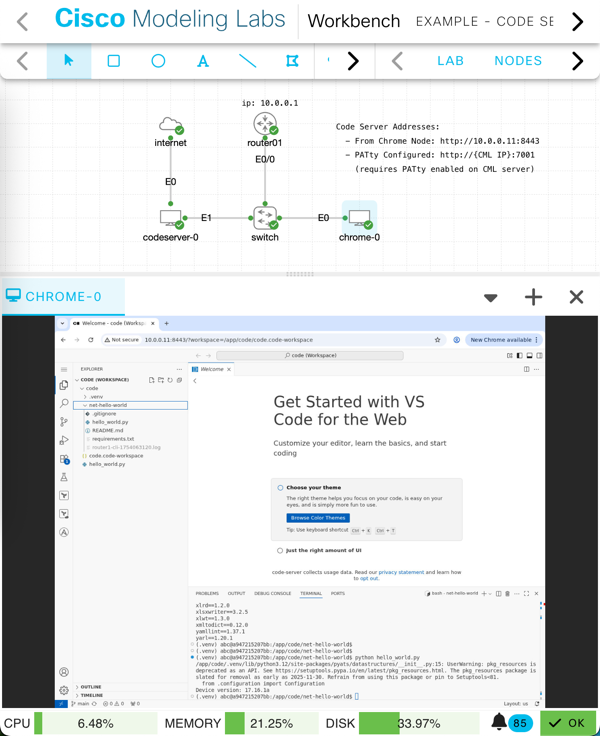
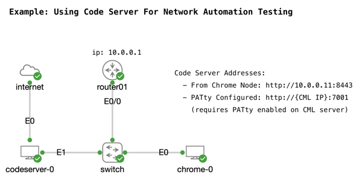

# Code Server Custom
Looking to easily add a network automation workspace to your CML topologies? Well this node definition is for you.  



Built from the [Linux Servers Container Image for "Code Server"](https://hub.docker.com/r/linuxserver/code-server), this node provides a web based VS Code interface that can be added into your CML topologies like any other node.

You can then use a Chrome/Firefox container within the topology to begin your automation work. Or setup a PATty connection, and directly access the Code Server from your local workstation.

## Node Details

* Requires CML version 2.9+
* Code Server Version 4.102.2 used 
* Automation Tools Included: 
    * Python 3.12.3
    * Terraform v1.12.2
* Default Workspace Configured: 
    * Path: `/app/code`
    * Python VENV: `/app/code/.venv` (No Packages Installed)
* Requires matching image definition and container image
    * Image Definition File: [`code-server.custom.01.4.102.yaml`](../../../virl-base-images/opensource/code-server.custom.01.4.102/code-server.custom.01.4.102.yaml).
    * Container Image: [`code-server-custom.01.4.102.tar`](https://cml-images.nerdops.io/code-server-custom.01.4.102.tar.gz)

        > Note: CML container node definition, image definition, and container image file are tightly coupled. The image "name" (ex: `code-server-custom:01_04.102.2`), and the SHA Hash (ex: `6525a3a31...`) must match exactly. Changing to a different container image with your own customizations, will require updating the node and image definitions.

        * Container SHA value: `6525a3a31b1b18cf01f64425e96b080aeac86f87c0f02fc041792358bc599dd1` (Required for Image Definition Creation)

## Adding the node to your CML instance

> Container support was added in CML 2.9.0.

> Adding a container image to CML is slightly different than adding a typical VM based node. As with many things in the world, there are multiple ways to accomplish the same task. These instructions present one method, but feel free to adjust for your own environment and preferences as you see fit.

1. Import the node definition file to CML from the CML GUI.
2. Download the container image file to your local workstation. 

    ```
    # Example: 
    wget https://cml-images.nerdops.io/code-server-custom.01.4.102.tar.gz

    Saving to: ‘code-server-custom.01.4.102.tar.gz’

    code-server-custom.01.4.102.tar.gz    100%[=======>] 666.61M  47.1MB/s    in 14s     

    2025-08-01 16:17:27 (47.9 MB/s) - ‘code-server-custom.01.4.102.tar.gz’ saved [698992808/698992808]    
    ```

1. Upload the container image to the CML server. Here I use SCP to do the upload.

    ```
    scp code-server-custom.01.4.102.tar.gz admin@{CML_SERVER_ADDRESS}:

    code-server-custom.01.4.102.tar.gz       100%  667MB 315.1MB/s   00:02    
    ```

1. If the container image is compressed into a `.tar.gz` file like this example, you'll need to uncompress it into just a `.tar` file to continue. You can do this before you upload it to CML, but you can also do it on the CML server after the upload as the `sysadmin` account.  

    ```
    sudo -u virl2 gunzip /var/local/virl2/dropfolder/code-server-custom.01.4.102.tar.gz
    ```

    * Access the `sysadmin` terminal through the Cockpit interface, or by SSHing to the CML server (if enabled) on port 1122 
    * Use `sudo -u virl2` to run the unzip as the CML service account

1. Create the Image Definition using the CML GUI. Be sure to select the correct Node and Disk Image. You'll need to provide ID, Label, Description, and Disk Hash (SHA value).

    > There isn't an "Import" ability for Image Definitions, but you can use the details from the [image definition file here](../../../virl-base-images/opensource/code-server.custom.01.4.102/code-server.custom.01.4.102.yaml) in the CML Community to fill in the blanks. 

## Testing the Node Definition

If you'd like to test the new node definition, a simple CML topology file is included in this repo: [Example - Code Server Custom](Example_-_Code_Server_Custom.yaml)



This example includes the Code Server node with a configuraiton that automatically will clone down [https://github.com/hpreston/net-hello-world](https://github.com/hpreston/net-hello-world#) and install the Python requirements from the project automatically. There is also an IOL router, that the [`hello_world.py`](https://github.com/hpreston/net-hello-world/blob/main/hello_world.py) will use pyATS to query and print the device version. 

You can access the Code-Server using the Chrome node in the topology by navigating to the code-server address of `http://10.0.0.11:8443`.  If your CML server is configured for PATty, you can also access the code-server at `http://{CML_IP}:7001`.