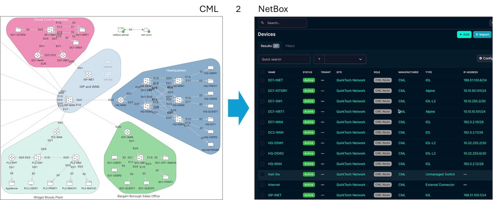
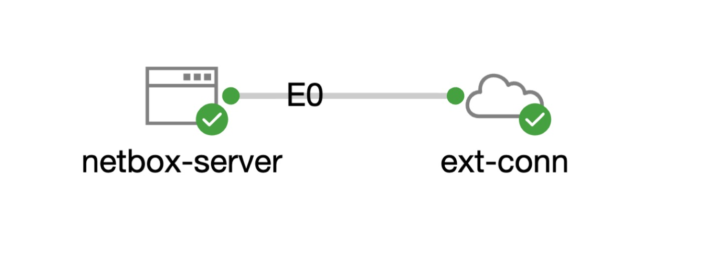
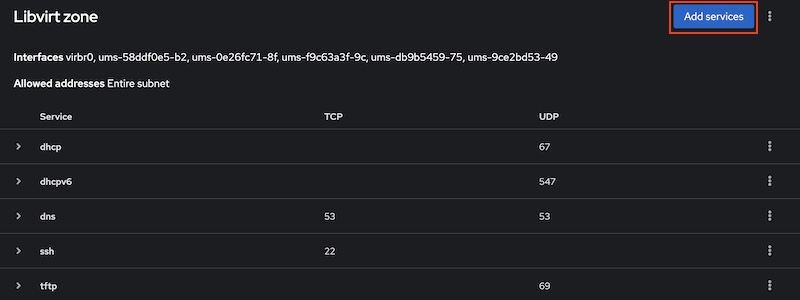
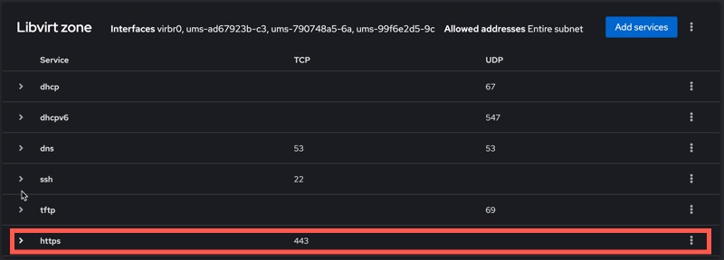
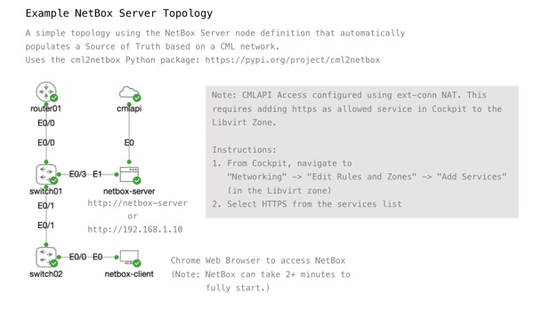

# NetBox Server Node
Have you ever wished you could easily add a NetBox server to your CML topology?  What about have the NetBox server automatically populate with data for the network you've built in the lab?  



This is the node definition for you! 

## Technical Details for the Node
The `NetBox` node and image definitions were built to make it as easy and straighforward as possible to add a network source of truth to your CML labs.  

* [NetBox Community Edition](https://github.com/netbox-community/netbox) is installed and setup using the [netbox-docker](https://github.com/netbox-community/netbox-docker) project
* The base for the node/image is the included Alpine image from the CML reference platform
* The base image for `NetBox` has been pre-configured with the following user

    > Note: The `NetBox` node definition is designed for use within CML labs for testing, learning, and development. It is not intended for anything remotely close to a "production" deployment. This default account is purposefully using insecure credentials the same way other CML nodes default to simple credentials.

    * An admin user `cisco` with password `cisco` has been created
    * The `cisco` user has a read/write API key configured as `0123456789012345678901234567890123456789`
* A manufacturer called "CML" has been created
* Device types have been pre-populated in NetBox for CML standard reference platforms as well as some additional "custom" nodes
* The [cml2netbox](https://pypi.org/project/cml2netbox/) Python utility is installed at `/home/cisco/cml2netbox/`
    * This Python utility connects to the CML controller via the API to support auto-population of NetBox from CML
    * The primary usecase is to populate devices, cables, and IP addresses based on the CML lab topology. 
    * It can also be used to add new NetBox Device Types from CML Node Definitions if your server has custom definitions not included by default

        ```
        # From the console of the netbox-server node
        cml2netbox sync device-types
        ```

* A [detailed default day 0 configuration example](example-netbox-server-default-day0.sh) with details on how to use in your labs

## Adding the NetBox Node/Image to CML
The `NetBox` custom node and image definition is added to NetBox like any other VM based node/image. 

1. Import the node definition [`netbox-server.yaml`](netbox-server.yaml) into your CML server
1. Download the custom image file [`netbox-server-4-4-5_alpine-3-21-3.qcow2`](https://cml-images.nerdops.io/netbox-server-4-4-5_alpine-3-21-3.qcow2) to your local workstation. 

    > This custom base image for NetBox version 4.4.5 built ontop of Alpine 3.21 is offered for your use under the same open source license as the CML-Community project itself. 

1. Upload the qcow2 VM image file to the CML server. This can be done from the GUI, or through SCP. 
1. Create the Image Definition using the CML GUI. Be sure to select the correct Node and Disk Image. You'll need to provide ID, Label, Description, and other information.

    > There isn't an "Import" ability for Image Definitions, but you can use the details from the [image definition file here](../../../virl-base-images/opensource/netbox-server-4-3-5_alpine-3-21-3/netbox-server-4-3-5_alpine-3-21-3.yaml) in the CML Community to fill in the blanks. 

## Requirments for Use in a Topology 
In order for the NetBox server node to create the Devices, Cables, and IP Addresses for your CML topology, the NetBox node needs access to the CML API. This will require an `ext-conn` to be part of the CML topology and connected to the `netbox-server` node.  



The simplest option would be like this image. The `netbox-server` node is connected to the `ext-conn` directly. However, any option that provides a network path out to the `ext-conn` and then to the CML server itself should work. 

### Applying Startup Config to the NetBox Server
In order for the CML topology to be automatically loaded into the NetBox server at startup, you ***must*** update the default CONFIG for the node with details specific to your lab.  At a minimum the following lines must be uncommented and updated with details for your environment. 

```shell
# export VIRL2_URL=https://192.0.2.1
# export VIRL2_USER=admin
# export VIRL2_PASS=1234QWer
# export VIRL2_VERIFY_SSL=False
# export LAB_NAME="My CML Topology"
```

* The `VIRL2_*` ENVs are used by the sync tool to connect to your CML server.  
* The `LAB_NAME` ENV needs to be the case *sensitive* Lab Title for the specific topology you want to populate in NetBox.  
    * Note - It is NOT required that the `LAB_NAME` be the SAME lab that is running the NetBox server node. It just needs to be a lab on the CML server referenced in the `VIRL2_*` ENVs. 
    * Note 2 - If your CML server has more than one lab with the same title (CML itself does NOT prevent 2 labs with the same title from being added to the dashboard), you must set the `LAB_ID` ENV as well.  You can find the ID (UUID) for the lab in the workbench URL. 

#### Other CONFIG options
You'll find comments within the default config for other configuraiton changes to the NetBox server that are optional. These include

* Configuring network interface settings. 
  * By default, the NetBox server will use DHCP on eth0. Other interfaces will be unconfigured
* You can create additional Linux user accounts on the server. 
    * By default, a single root user `cisco / cisco` is configured

You can also add any additional shell script commands to the CONFIG that you desire. The NetBox server is an Alpine Linux server, any configuration supported on Alpine should work on this server.

### Using a Bridge External Connector
If your topology and external connector is configured in "bridge mode" such as `System Bridge: (bridge0)`, no special configuration is required.  Just use the management IP address for the `VIRL2_URL` in the `CONFIG` for `NetBox` where your CML settings are set. 

For example, if the CML server's management IP is `10.1.20.10`, you would set the value like this.

```bash
export VIRL2_URL=https://10.1.20.10
```

### Using a NAT External Connector
The default CML configuration for the NAT external connector blocks access to the CML API. Specifically it does not allow HTTPs traffic within the "Libvirt zone" that is applied to the `virbr0` bridge interface that is the underlying network bridge for the NAT external connector in CML. 



If your topology uses the NAT external connector, and you'd like to add the NetBox server node, there are two options. 

1. Add a second external connector to the topology in "bridge" mode connected to the `eth1` interface of the NetBox server.  Apply an IP address on the bridge network to the NetBox servers eth1 interface in the CONFIG.  The default day 0 config for NetBox includes comments and example commands to do this. 

    ```
    ip link set up dev eth1
    ip addr add 192.0.2.2/24 dev eth1
    ```

2. Add HTTPS as an allowed service in the "Libvirt zone" via Cockpit. This will allow access to the CML API (as well as the CML web gui) from nodes on a topology through the NAT external connector. 

    > Note: This involves changing the default firewall rules for CML. Consider your personal security requirements before making this change.  Also, it is likely you'll need to redo this change after any CML upgrades as the default configuration would be restored. 

    1. From Cockpit, navigate to "Networking" -> "Edit Rules and Zones" -> "Add Services" (in the Libvirt zone)
    1. Select HTTPS from the services list

    

You would then use the IP address `192.168.255.1` for the `VIRL2_URL` address.  This is the CML servers IP address on the NAT bridge interface, `virbr0`.  

```bash
export VIRL2_URL=https://192.168.255.1
```

## Example Topology
An example CML Topology using the NetBox server node definition is included [here](Example_NetBox_Server_Topology.yaml) for reference. 

> This example DOES use a NAT ext-conn so it requires the addition of the `https` service to the Libvirt zone in Cockpit. For details see above. 



## Upgrading NetBox / NetBox-Docker
The NetBox project moves quick, far quicker than this example node/image definition will be upgraded.  Should you want to upgrade the NetBox version running in a lab, you can follow the basic [NetBox Docker Updating Instructions](https://github.com/netbox-community/netbox-docker/wiki/Updating). 

> Note: As with any update to NetBox, be sure to read the release notes to see whether any breaking changes might be discovered. 
> 
> Note 2: These steps will upgrade the specific instance of the NetBox server running in your lab. These will NOT upgrade the underlying image definition used in CML. The details on how to do that are out of scope for this README, but are no different than any other custom image creation steps done with CML for other nodes. 

Here are the basic steps and commands that should work on the CML NetBox Server Node: 

1. Log into the NetBox server node at the console. 
2. Change to the netbox-docker directory
    ```
    cd netbox-docker/
    ```

2. Shutdown NetBox-Docker
    ```
    docker compose down
    ```

3. Save any changes to project/repo files to a local "git stash"

    > Example: The `env/netbox.env` file has been updated in this node to allow duplicate IP addresses. 

    ```
    git stash
    ```

4. Pull down changes to netbox-docker from GitHub

    ```
    git pull -p origin release
    ```

5. Fix any breaking changes due to update. This will vary depending on the version being updated to. 

6. Pull updated container images

    ```
    docker compose pull
    ```

7. Reapply changes to files (ie env/netbox.env)

    ```
    git stash apply 
    ```

8. Startup NetBox-Docker and automated NetBox update

    ```
    docker compose up -d
    ```

    > Note: This step tends to take a few minutes and the docker command may report an error. You can monitor the upgrade and startup with docker commands such as: 
    > 
    > * `docker compose logs -f`
    > * `docker compose ps`

