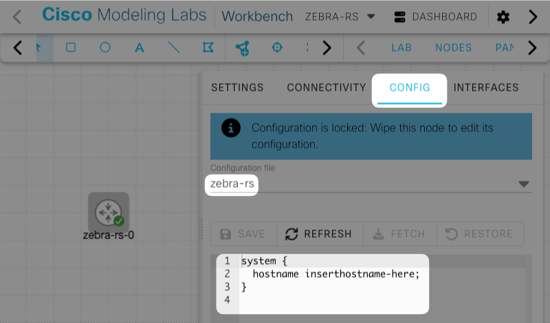

# zebra-rs

[zebra-rs](https://zebra.rs/) is a BGP, OSPF, and IS‑IS routing stack with SRv6, SR-MPLS, L3VPN, and EVPN extensions, written from scratch in Rust. Memory‑safe, async to the core, idempotent by design — and the first routing daemon to ship with a native MCP server for AI agents.

- [zebra-rs](https://zebra.rs/)
- [Get started](https://zebra.rs/install.html)
- [Read the docs](https://zebra.rs/docs.html)

## How to Obtain Images

You can download the zebra-rs qcow2 image from the link below.

- [zebra-rs Images for Cisco CML](https://s3.sig9.org/zebra-rs/index.html)

## Credentials

SSH is available on this image. The default credentials are as follows.

|Username|Password|
|-----|-----|
|zebra-rs|zebra-rs|

## Support for Pre-Configuration via Cloud-Init

This qcow2 image supports Cloud-Init. You can configure it in advance by selecting “zebra-rs” from the node's CONFIG tab.

