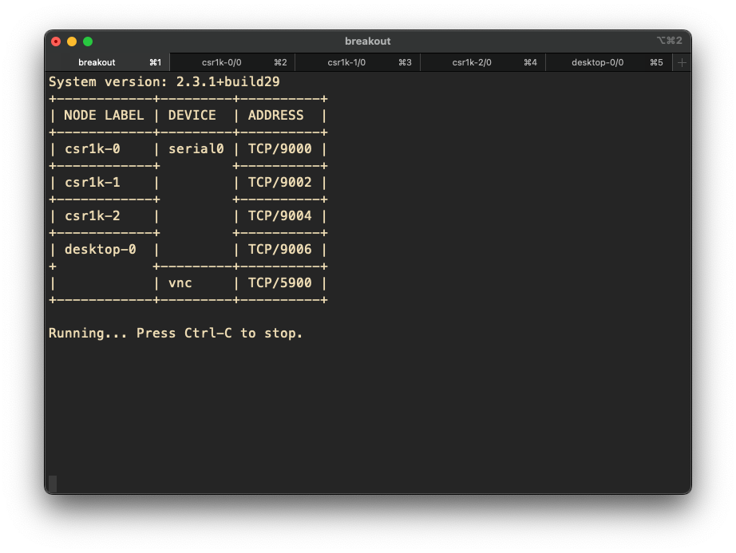
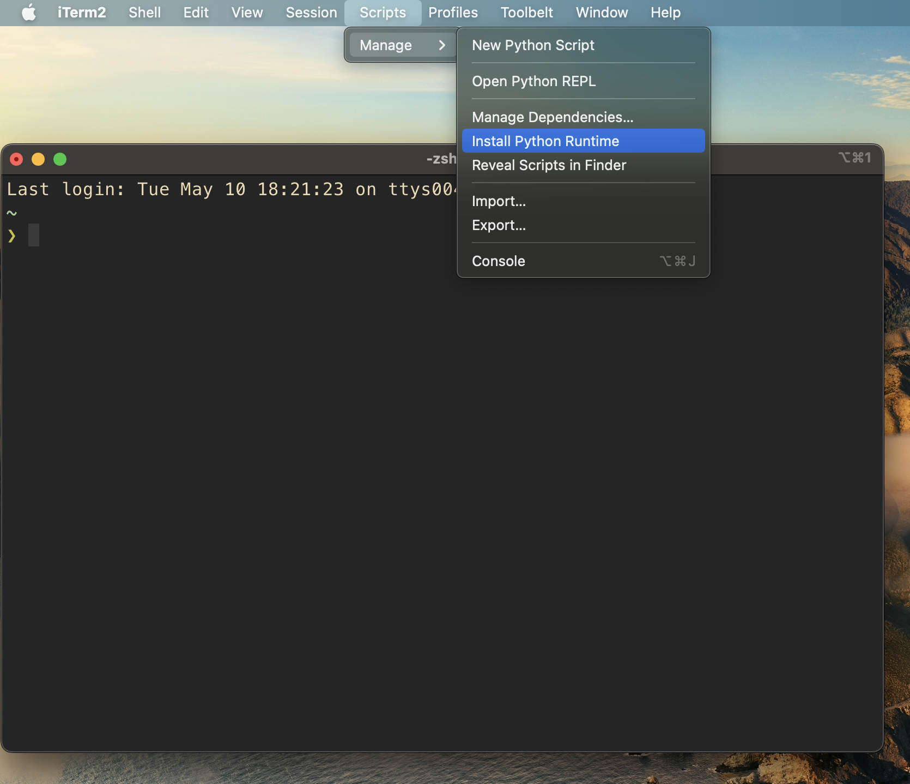
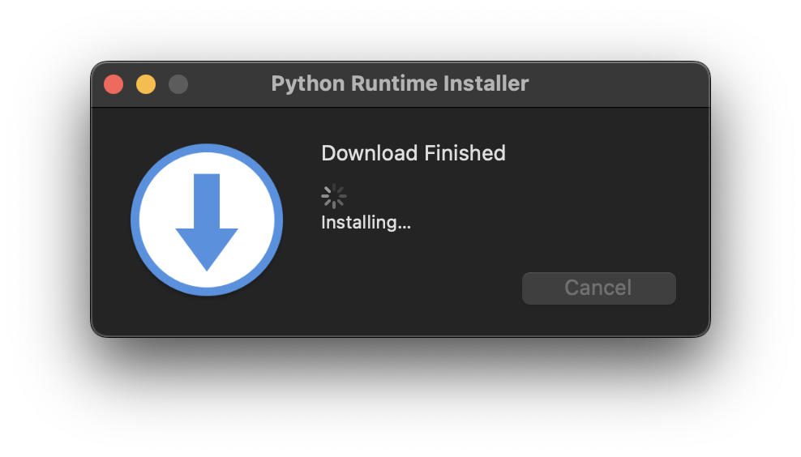
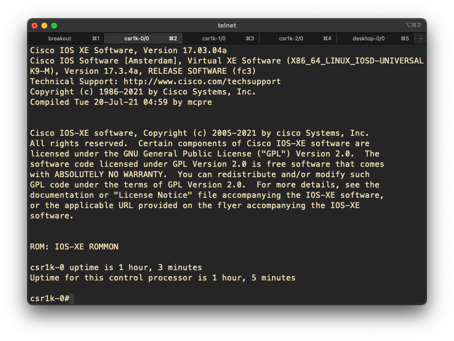

## CML breakout to iTerm2

This script reads a CML breakout `labs.yaml` and generates a python script for each lab using Jinja2.
Each python script contains the code to start one of your CML lab, using the iTerm2's [Python API](https://iterm2.com/python-api/).
When launched from iTerm2, a script will open a new window, start the breakout tool and telnet to each nodes for one of your lab.



<p align="right">(<a href="#top">back to top</a>)</p>

## Getting Started

### Prerequisites

- Install iTerm2 if not done already, for example:

```
brew install iterm2
```

- Install the iTerm2's Python Runtime:

From iTerm2's menu, go to `Scripts -> Manage -> Install Python Runtime`



This will download and install the iTerm2's Python Runtime:



### Installation

Clone the repository, cd in the directory and install the requirements:

- pipenv

```
pipenv install
```

- pip

```
python3 -m venv /path/to/directory
pip install -r requirements
```

Note: the only dependences are `pyyaml` and `jinja2`.

## Usage

The following options are available:

```
❯ python3 brk2iterm.py -h
usage: brk2iterm.py [-h] [-d BRK_DIR] [-f YAML_FILE] [-l LISTEN_ADDR] [-s SLEEP]
                    [-j JINJA2_TEMPLATE]

reads a CML breakout labs.yaml generates iterm python scripts

optional arguments:
  -h, --help            show this help message and exit
  -d BRK_DIR, --brk-dir BRK_DIR
                        path to dir containing the breakout labs YAML files (default:
                        current directory)
  -f YAML_FILE, --yaml-file YAML_FILE
                        name of the 'labs' YAML file, (default: labs.yaml)
  -l LISTEN_ADDR, --listen_addr LISTEN_ADDR
                        specify the listen address (default: ::1)
  -s SLEEP, --sleep SLEEP
                        sleep time (in seconds) before initiating telnet session (default:
                        3)
  -j JINJA2_TEMPLATE, --jinja2-template JINJA2_TEMPLATE
                        full path to the iterm_script.j2 Jinja2 template (default:
                        ./iterm_script.j2)
```

### Generate your CML breakout labs's configurations:

Use `breakout init` or `breakout ui` to fetch the labs and nodes from the controller and generate the `labs.yaml` file:

```
❯ breakout init
get simplified node definitions from controller...
get active console keys from controller...
get active VNC keys from controller...
get all the labs from controller...
get all the nodes for the labs from controller...
get nodes for lab L2L IKEv2 from controller...
get nodes for lab cisco_isis_sr_101_v1 from controller...
config written.

❯ ls -l
.rwxrwxrwx  746 sgherdao 11 Mar 21:04 config.yaml
.rwxrwxrwx 1.3k sgherdao  3 May 21:50 labs.yaml
```

_Note: check your `labs.yaml` file and ensure that `enabled` is set to true for all the desired labs_

### Launch brk2iterm.py

```
❯ python3 brk2iterm.py --brk-dir ~/CML/

❯ ls -l
.rw-r--r--   659 sgherdao 10 May 19:03 1eaf2c3b-9207-4524-9e7c-3eeaada67886.py  <<
.rw-r--r--  3.0k sgherdao 10 May 18:13 brk2iterm.py
.rw-r--r--  2.0k sgherdao 10 May 19:03 d231681f-a88c-4004-884a-4c9639ad8b07.py  <<
.rw-r--r--@ 1.0M sgherdao 10 May 18:29 install_py_runtime01.png
.rw-r--r--@ 172k sgherdao 10 May 18:31 install_py_runtime02.png
.rw-r--r--   769 sgherdao 10 May 18:15 iterm_script.j2
.rw-r--r--   164 sgherdao 10 May 18:09 Pipfile
.rw-r--r--  7.7k sgherdao 10 May 18:09 Pipfile.lock
.rw-r--r--  3.7k sgherdao 10 May 18:37 README.md
```

Feel free to give the python iTerm2 scripts less machine friendly names and move
the files to the iTerm2 Scripts directory, the folder should be located there
`~/Library/Application\ Support/iTerm2/Scripts`:

```
❯ mv 1eaf2c3b-9207-4524-9e7c-3eeaada67886.py ~/Library/Application\ Support/iTerm2/Scripts/l2l.py
```

### Launch the lab's script from iTerm2's menu:


### Happy labbing!



<p align="right">(<a href="#top">back to top</a>)</p>
